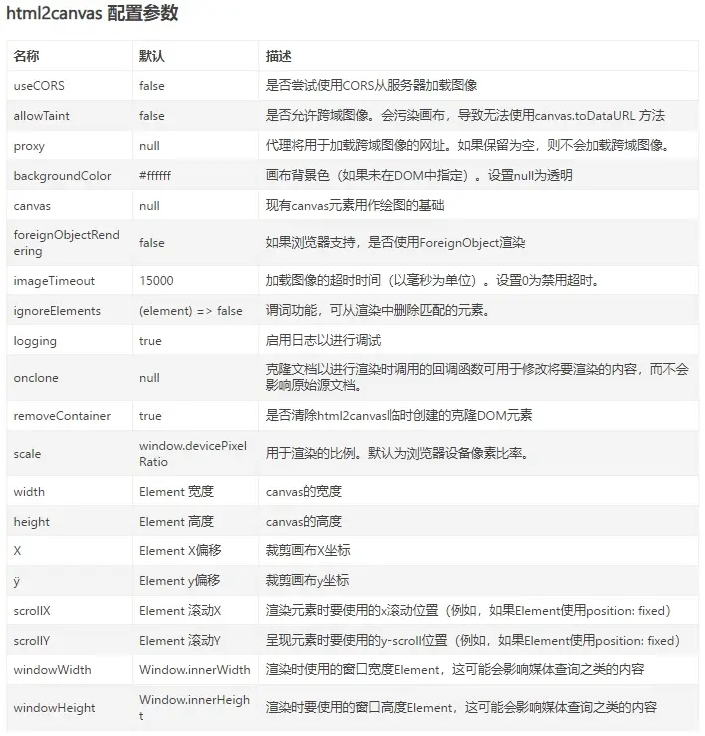

# sp-html2canvas-render

基于 `html2canvas` + `renderjs` 的截图插件，可根据 dom 盒子 id 截图，可截长图。

> 强烈建议优先前往 [`插件市场`](https://ext.dcloud.net.cn/plugin?id=15050) 导入示例项目参考一下。

## 安装

1. [插件市场](https://ext.dcloud.net.cn/plugin?id=15050) 中点击 `下载插件并导入HBuildeX`。
2. 在你的项目中安装 `html2canvas` 的 node 包。
   ::: code-group
   ```bash [npm]
   npm install html2canvas
   ```
   ```bash [yarn]
   yarn add html2canvas
   ```
   ```bash [pnpm]
   pnpm add html2canvas
   ```
   :::

## 前言

1. 首先你可能需要了解 [`renderjs`](https://uniapp.dcloud.net.cn/tutorial/renderjs.html#renderjs) 是什么，以及 renderjs 的平台差异与兼容性。
2. html2canvas 的相关配置：

## 插件兼容性

> `✔️ 实测可行` `❌ 未兼容` `➖ 未实测`

| Vue2 | Vue3 | H5  | App | 微信小程序 | 支付宝小程序 |
| :--: | :--: | :-: | :-: | :--------: | :----------: |
|  ✔️  |  ✔️  | ✔️  | ✔️  |     ❌     |      ❌      |

1. 由于 renderjs 目前只支持 App 和 H5，所以本插件也只能支持 App 和 H5。
   
2. 本插件基于 html2canvas，不支持小程序，微信小程序请移步 [`wxml2cavnas`](https://developers.weixin.qq.com/community/develop/article/doc/000040894e4360456ff7654be56013)。

## prop 参数

| 参数  | 类型   | 默认值 | 必填 | 说明             |
| ----- | ------ | ------ | ---- | ---------------- |
| domId | String |        | 是   | 要渲染 dom 的 id |

## emit 事件

| 事件名     | 参数                  | 说明         |
| ---------- | --------------------- | ------------ |
| renderOver | e: 生成的 base64 图片 | 渲染完成回调 |

:::tip
返回的是 base64 字符串，如果需要转成路径的，请使用插件内置的 base64ToPath 方法进行转换

```javascript
import { base64ToPath } from "@/uni_modules/sp-html2canvas-render/utils/index.js";

function renderOver(e) {
  // e为导出图片的base64
  base64ToPath(e).then((res) => {
    console.log("==== path :", res);
  });
}
```

该转换方法是在 [`image-tools`](https://ext.dcloud.net.cn/plugin?id=123) 插件中提取而出，望尊重并支持原插件。
:::

## 方法

| 方法名       | 参数 | 说明                       |
| ------------ | ---- | -------------------------- |
| h2cRenderDom |      | 调用该方法即可开始截图渲染 |

:::warning
请注意调用时机，确保你指定 domid 的盒子已经渲染完成的情况下再调用 h2cRenderDom 方法，否则会报找不到 dom 的错。
:::

## 使用示例

::: code-group

```vue [vue2]
<template>
  <view class="index">
    <sp-html2canvas-render domId="render-dom" ref="renderRef" @renderOver="renderOver"></sp-html2canvas-render>
    <!-- 主渲染内容 -->
    <view id="render-dom" class="render-content">
      <h4>有问题欢迎进群讨论，QQ交流群: 852637893</h4>
    </view>
    <!-- 导出按钮自定义 -->
    <button @click="cusRenderDom">导出</button>
  </view>
</template>

<script>
export default {
  data() {
    return {};
  },
  methods: {
    cusRenderDom() {
      // 调用组件实例中h2cRenderDom方法
      this.$refs.renderRef.h2cRenderDom();
    },
    renderOver(e) {
      // e为导出截图的base64格式字符串
      console.log("==== renderOver :", e);
    },
  },
};
</script>
```

```vue [vue3]
<template>
  <view class="index">
    <sp-html2canvas-render domId="render-dom" ref="renderRef" @renderOver="renderOver"></sp-html2canvas-render>
    <!-- 主渲染内容 -->
    <view id="render-dom" class="render-content">
      <h4>有问题欢迎进群讨论，QQ交流群: 852637893</h4>
    </view>
    <!-- 导出按钮自定义 -->
    <button @click="cusRenderDom">导出</button>
  </view>
</template>

<script setup>
import { ref } from "vue";

const renderRef = ref();
function cusRenderDom() {
  renderRef.value.h2cRenderDom();
}

function renderOver(e) {
  // e为导出截图的base64格式字符串
  console.log("==== renderOver :", e);
}
</script>
```

:::

## 疑难解答

> 可新建 [`Issue`](https://gitee.com/Sonve/sv-app-docs/issues/new) / [`悬赏`](https://gitee.com/Sonve/sv-app-docs/reward_issues/new) 来 [`发起提问`](https://gitee.com/Sonve/sv-app-docs/issues)

1. 为什么会报 `toDataURL on HTMLCanvasElement` 的错？

   - 如果你要渲染的 dom 盒子中带有不支持跨域的网络图片，html2cavnas 就会报这个画布被污染了的错，需要你的网络图片支持跨域。这里建议要渲染的 dom 盒子中的所有图片（包括网络和本地图片）都经过内置的 `pathToBase64` 或 `urlToBase64` 方法进行转换，base64 可以兼容各端差异，不会存在跨域问题，但是前提是你的网络图片支持跨域，如果你的网络本身就不支持跨域那也没有办法，虽然 html2canvas 提供了相关跨域的配置项，但是实测下来在 uniapp 中无效，所以还是得从解除跨域的根本原因上解决。
     :::tip 关于跨域的题外话

     - 在 HBuilderX 的内置浏览器中是自动解除了跨域的，所以内置浏览器中可能一切正常，但是真机或者外置浏览器上可能就会报跨域的错了。
     - 有的小伙伴在外置浏览器上直接输入网络图片的链接，觉得能打开显示图片就是没跨域了，其实并不是这个道理。跨域是浏览器的同源策略问题，你从你的 localhost 去访问在线的地址，域名自然就对不上了，浏览器就不允许你访问。直接在浏览器上输入网络图片打开，这自然就是同源的，浏览器也支持你去打开图片。
       :::

   - 如果你的图片是以盒子的 background: url(xxx) 形式作为背景图片的，也需要将其转为 base64 ，示例工程中示例四中有说明。

2. 截出来的图片模糊怎么办？

   - 将你 dom 中的 image 标签改为 img 标签。
   - 改为 img 还是模糊？那就将 img 作为字符串，放到 rich-text 富文本中试试。
   - 以上两种方法实测能有效解决图片模糊问题，已在示例工程的示例二中体现。
   - 简单示例：（此处为伪代码，具体建议前往 [`插件市场`](https://ext.dcloud.net.cn/plugin?id=15050) 导入示例项目以供参考）

     ```vue
     <!-- 原写法 -->
     <image style="width: 200px" mode="widthFix" :src="webImageBase1" />
     <!-- 使用img代替image可有效解决图片模糊问题 -->
     
     <!-- 还模糊？再试试以富文本形式吧 -->
     <rich-text :nodes="``"></rich-text>
     ```

   - 还是无法解决？[进群](https://qm.qq.com/cgi-bin/qm/qr?k=HD9IXnUruOa5pplF1jAeQsLb9BNnP_DE&jump_from=webapi&authKey=tk61Q5la3EAprdYcUBD7v0PBly795OTcT4UT36XxqcG7pmhGRpE+yFlt75vQBWeY) 探讨下吧。

3. 报错 `dom盒子未加载成功，请先确保dom渲染完成，再检查你的domId是否有误`

   - 报这个错一般是你的 dom 盒子还没有获取到就开始调用导出了，所以要先确保你指定的盒子先加载完成后再调用 h2cRenderDom 方法渲染导出图片。
   - 初学者可能常见的原因： ① 在 onLoad 生命周期中调用 h2cRenderDom 渲染导出，此时页面视图并未完全加载好，故报错（加个 [`nextTick`](https://cn.vuejs.org/api/general.html#nexttick) 等页面视图加载完成后执行即可）；② 指定的 dom 盒子被 v-if="false" 给隐藏掉了。

4. 报错 `Cannot read property 'watchExpOver' of undefined`

   - 我猜你是在微信小程序里用了本插件，请看清本文档上述 [`插件兼容性`](#插件兼容性) 描述。

5. 最后生成的格式是 base64，但是我想要图片路径怎么办？

   - 插件内置了 `base64ToPath` 方法，将 base64 转换为临时图片路径，可用于上传到服务器。

     ```javascript
     import { base64ToPath } from "@/uni_modules/sp-html2canvas-render/utils/index.js";

     function renderOver(e) {
       base64ToPath(e).then((res) => {
         console.log("==== 图片临时路径 :", res);
         // ...后续处理
       });
     }
     ```

6. 截长图（dom 盒子超出视窗）时截图不全怎么办？

   - 截长图时要注意 css 写法，请仔细参考示例工程中示例一，切勿限制写死了宽高。

7. 截图时 dom 中有部分元素不想被截下来怎么办？
   - 在要截之前先将该部分元素 v-if="false" 隐藏掉，截完了再改为 true 即可，示例工程中示例一有说明。

## 写在最后

若对插件有任何疑问或者优化建议，欢迎在 [插件评论区](https://ext.dcloud.net.cn/plugin?id=15050#rating) 留言，在插件市场中的私信消息本人可能不经常留意，导致没能及时回复，
可以加入本人的插件问答 QQ 交流群: 852637893，欢迎 [进群交流](https://qm.qq.com/cgi-bin/qm/qr?k=HD9IXnUruOa5pplF1jAeQsLb9BNnP_DE&jump_from=webapi&authKey=tk61Q5la3EAprdYcUBD7v0PBly795OTcT4UT36XxqcG7pmhGRpE+yFlt75vQBWeY)。

> 写文档码字感觉真累啊，果然最讨厌的两件事：一是找到合适的插件没文档，二是自己写的插件要自己写文档了_(:з」∠)_。如果有帮助到您，希望能 [鼓励一下](../../donate/donate.md) 吧~ 谢谢 ♪(･ω･)ﾉ


