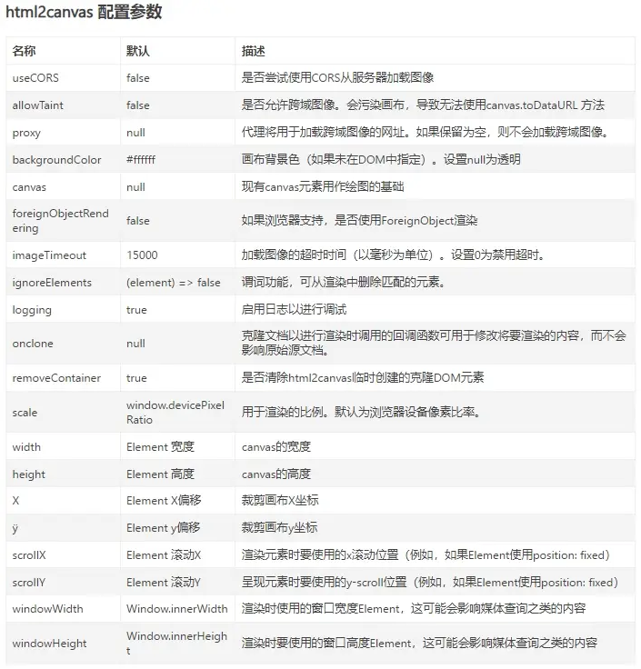

# DOM 导出 PDF [`sp-html2pdf-render`](https://ext.dcloud.net.cn/plugin?id=15087)

基于 `html2canvas` + `jspdf` + `renderjs` 的截图导出 pdf 插件，可根据 dom 盒子 id 截图。

## 主要功能

1. 可根据指定 domid 截取盒子导出 pdf。
2. 可截长盒子。
3. 可生成 图片/pdf 两种格式。
4. 使用简单直白易上手。
5. 内置 renderjs 写法可供参考。

> 强烈建议优先前往 [`插件市场`](https://ext.dcloud.net.cn/plugin?id=15087) 导入示例项目参考一下。
> 示例工程中插件可能不是最新版本，运行之前建议先将示例工程中插件更新至最新版本哦。

## 安装

1. [插件市场](https://ext.dcloud.net.cn/plugin?id=15087) 中点击 `下载插件并导入HBuildeX`。
2. 在你的项目中安装 `html2canvas` 和 `jspdf` 的 node 包。
   ::: code-group
   ```bash [npm]
   npm install html2canvas
   npm install jspdf
   ```
   ```bash [yarn]
   yarn add html2canvas
   yarn add jspdf
   ```
   ```bash [pnpm]
   pnpm add html2canvas
   pnpm add jspdf
   ```
   :::

## 前言

1. 首先你可能需要了解 [`renderjs`](https://uniapp.dcloud.net.cn/tutorial/renderjs.html#renderjs) 是什么，以及 renderjs 的平台差异与兼容性。
2. html2canvas 的相关配置：

## 插件兼容性

> `✔️ 实测可行` `❌ 未兼容` `➖ 未实测`

| Vue2 | Vue3 | H5  | App | 微信小程序 | 支付宝小程序 |
| :--: | :--: | :-: | :-: | :--------: | :----------: |
|  ✔️  |  ✔️  | ✔️  | ✔️  |     ❌     |      ❌      |

1. 由于 renderjs 目前只支持 App 和 H5，所以本插件也只能支持 App 和 H5。
   
2. 本插件基于 html2canvas，不支持小程序，微信小程序请移步 [`wxml2cavnas`](https://developers.weixin.qq.com/community/develop/article/doc/000040894e4360456ff7654be56013)。

## prop 参数

| 参数        | 类型    | 默认值 | 必填 | 说明                                                                              |
| ----------- | ------- | ------ | ---- | --------------------------------------------------------------------------------- |
| domId       | String  |        | 是   | 要渲染 dom 的 id                                                                  |
| showLoading | Boolean | true   | 否   | 是否显示导出 loading                                                              |
| pdfFileName | String  |        | 否   | 导出的 pdf 文件名，默认使用当前时间戳，已自动拼接后缀（仅 App 端可用，H5 端无效） |
| autoOpen    | Boolean | true   | 否   | 是否自动打开文档，默认开启                                                        |

## emit 事件

| 事件名         | 参数                      | 说明                                                                                          |
| -------------- | ------------------------- | --------------------------------------------------------------------------------------------- |
| renderOver     | e: 生成的 图片（base64）  | 渲染图片完成回调                                                                              |
| beforeSavePDF  | e: 生成的 pdf（base64）   | 渲染 pdf 完成回调                                                                             |
| successSavePDF | e: 生成的 pdf（临时路径） | 需要开启 [`autoOpen`](#prop-参数)，或手动调用 [`openPDF`](#实例方法)，打开文件 pdf 成功时回调 |

:::tip
返回的是 base64 字符串，如果需要转成路径的，请使用插件内置的 base64ToPath 方法进行转换

```javascript
import { base64ToPath } from "@/uni_modules/sp-html2pdf-render/utils/index.js";

function beforeSavePDF(e) {
  // e为导出的pdf（base64）
  base64ToPath(e).then((res) => {
    console.log("==== path :", res);
  });
}
```

该转换方法是在 [`image-tools`](https://ext.dcloud.net.cn/plugin?id=123) 插件中提取而出，望尊重并支持原插件。
:::

## 实例方法

| 方法名       | 参数                                                          | 说明                                                                   |
| ------------ | ------------------------------------------------------------- | ---------------------------------------------------------------------- |
| h2pRenderDom | 无                                                            | 调用该方法即可开始截图渲染导出 pdf                                     |
| openPDF      | e: pdf 的 base64，从 [`beforeSavePDF`](#emit-事件) 事件中获取 | 在关闭 [`autoOpen`](#prop-参数) 的情况下，有时需要自定义时机去打开文档 |

:::warning
请注意调用时机，确保你指定 domid 的盒子已经渲染完成的情况下再调用 h2pRenderDom 方法，否则会报找不到 dom 的错。
:::

## 使用示例

::: code-group

```vue [vue2]
<template>
  <view class="index">
    <sp-html2pdf-render
      domId="render-dom"
      ref="renderRef"
      pdfFileName="这是一个pdf文件"
      @beforeSavePDF="beforeSavePDF"
      @successSavePDF="successSavePDF"
      @renderOver="renderOver"
    ></sp-html2pdf-render>
    <!-- 主渲染内容 -->
    <view id="render-dom" class="render-content">
      <h4>有问题欢迎进群讨论，QQ交流群: 852637893</h4>
    </view>
    <!-- 导出按钮自定义 -->
    <button @click="cusRenderDom">导出</button>
  </view>
</template>

<script>
export default {
  data() {
    return {};
  },
  methods: {
    cusRenderDom() {
      // 调用组件实例中h2pRenderDom方法
      this.$refs.renderRef.h2pRenderDom();
    },
    renderOver(e) {
      // e为导出的图片（base64）
      console.log("==== renderOver :", e);
    },
    beforeSavePDF(e) {
      // e为导出的pdf（base64）
      console.log("==== beforeSavePDF :", e);
    },
    successSavePDF(path) {
      // e为打开的pdf（临时路径）
      console.log("==== successSavePDF :", path);
    },
  },
};
</script>
```

```vue [vue3]
<template>
  <view class="index">
    <sp-html2pdf-render
      domId="render-dom"
      ref="renderRef"
      pdfFileName="这是一个pdf文件"
      @beforeSavePDF="beforeSavePDF"
      @successSavePDF="successSavePDF"
      @renderOver="renderOver"
    ></sp-html2pdf-render>
    <!-- 主渲染内容 -->
    <view id="render-dom" class="render-content">
      <h4>有问题欢迎进群讨论，QQ交流群: 852637893</h4>
    </view>
    <!-- 导出按钮自定义 -->
    <button @click="cusRenderDom">导出</button>
  </view>
</template>

<script setup>
import { ref } from "vue";

const renderRef = ref();
function cusRenderDom() {
  renderRef.value.h2pRenderDom();
}

function renderOver(e) {
  // e为导出的图片（base64）
  console.log("==== renderOver :", e);
}

function beforeSavePDF(e) {
  // e为导出的pdf（base64）
  console.log("==== beforeSavePDF :", e);
}

function successSavePDF(path) {
  // e为打开的pdf（临时路径）
  console.log("==== successSavePDF :", path);
}
</script>
```

:::

## 疑难解答

> 可新建 [`Issue`](https://gitee.com/Sonve/sv-app-docs/issues/new) / [`悬赏`](https://gitee.com/Sonve/sv-app-docs/reward_issues/new) 来 [`发起提问`](https://gitee.com/Sonve/sv-app-docs/issues)

1. 本插件与 `sp-html2html-render` 插件师出同门，部分问题可移步至 [`sp-html2html-render`](../sp-html2canvas-render/sp-html2canvas-render.md#疑难解答)。

## 写在最后

若对插件有任何疑问或者优化建议，欢迎在 [插件评论区](https://ext.dcloud.net.cn/plugin?id=15087#rating) 留言，在插件市场中的私信消息本人可能不经常留意，导致没能及时回复，
可以加入本人的插件问答 QQ 交流群: 852637893，欢迎 [进群交流](https://qm.qq.com/cgi-bin/qm/qr?k=HD9IXnUruOa5pplF1jAeQsLb9BNnP_DE&jump_from=webapi&authKey=tk61Q5la3EAprdYcUBD7v0PBly795OTcT4UT36XxqcG7pmhGRpE+yFlt75vQBWeY)。

> 写文档码字感觉真累啊，果然最讨厌的两件事：一是找到合适的插件没文档，二是自己写的插件要自己写文档了*(:з」∠)*。如果有帮助到您，希望能 [鼓励一下](../../donate/donate.md) 吧~ 谢谢 ♪(･ω･)ﾉ


