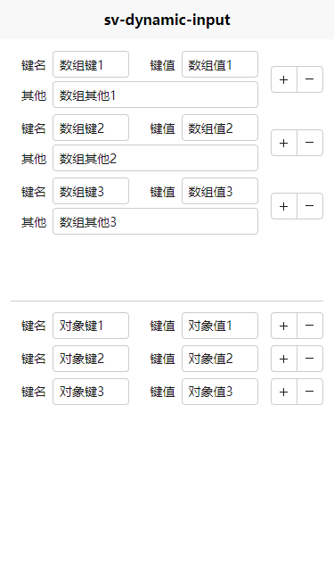

# sv-dynamic-input 动态录入

动态录入键值对（适用于表单动态添加字典字段）

## 主要功能

1. 动态添加字典字段（初始数据可数组可对象，最终生成结果统一为数组）
2. 支持插槽，自定义单元项数据，详见 [使用示例](#使用示例)

> 强烈建议优先前往 [`插件市场`](https://ext.dcloud.net.cn/plugin?id=15374) 导入示例项目参考一下。

## 安装

1. [插件市场](https://ext.dcloud.net.cn/plugin?id=15374) 中点击 `下载插件并导入HBuildeX`。

## 前言

## 插件兼容性

> `✔️ 实测可行` `❌ 未兼容` `➖ 未实测`

| Vue2 | Vue3 | H5  | App | 小程序 |
| :--: | :--: | :-: | :-: | :----: |
|  ✔️  |  ✔️  | ✔️  | ✔️  |   ➖   |

## prop 参数

| 参数             | 类型         | 默认值     | 必填 | 说明                                |
| ---------------- | ------------ | ---------- | ---- | ----------------------------------- |
| size             | String       | default    | 否   | 尺寸，可选值：small、default、large |
| data             | Array/Object | []         | 否   | 数据项，详见 [使用示例](#使用示例)  |
| lableKey         | String       | key        | 否   | 自定义 key 键名字段                 |
| lableText        | String       | 键名       | 否   | 自定义 key 键名名称                 |
| valueKey         | String       | value      | 否   | 自定义 value 键值字段               |
| valueText        | String       | 键值       | 否   | 自定义 value 键值名称               |
| textAlign        | String       | center     | 否   | lable 对齐方式                      |
| labelWidth       | String       | 40px       | 否   | lable 宽度                          |
| minRow           | Number       | 1          | 否   | 最小行数                            |
| maxRow           | Number       | 999        | 否   | 最大行数                            |
| keyPlaceholder   | String       | 请输入键名 | 否   | 键名占位字样                        |
| valuePlaceholder | String       | 请输入键值 | 否   | 键值占位字样                        |

## emit 事件

| 事件名 | 参数         | 说明                |
| ------ | ------------ | ------------------- |
| change | e：当前 data | data 数据改变时回调 |

## 使用示例

::: code-group

```vue [vue2]
<template>
  <view class="index">
    <view class="dynamic-cell">
      <sv-dynamic-input v-model:data="dict_data" lableKey="dkey" valueKey="dvalue" textAlign="right" @change="onChange">
        <template #default="{ data }">
          <view style="display: flex; align-items: center; margin-top: 8rpx">
            <text style="flex-shrink: 0; width: 40px; text-align: right">其他</text>
            <input type="text" class="dynamic-input" v-model="data.other" placeholder="请输入其他" />
          </view>
        </template>
      </sv-dynamic-input>
    </view>
    <view class="dynamic-cell">
      <sv-dynamic-input v-model:data="dict_cus" lableKey="objkey" valueKey="objvalue" textAlign="right" @change="onChange"></sv-dynamic-input>
    </view>
  </view>
</template>

<script>
export default {
  data() {
    return {
      dict_data: [
        { dkey: "数组键1", dvalue: "数组值1", other: "数组其他1" },
        { dkey: "数组键2", dvalue: "数组值2", other: "数组其他2" },
        { dkey: "数组键3", dvalue: "数组值3", other: "数组其他3" },
      ],
      dict_cus: {
        对象键1: "对象值1",
        对象键2: "对象值2",
        对象键3: "对象值3",
      },
    };
  },
  onLoad() {},
  methods: {
    onChange(e) {
      console.log("==== onChange :", e);
    },
  },
};
</script>

<style lang="scss">
.dynamic-input {
  border: 1px solid #cccccc;
  width: 100%;
  height: calc(var(--dynamic-input-size) * 2);
  padding: 0 calc(var(--dynamic-input-size) / 2);
  margin-left: calc(var(--dynamic-input-size) / 2);
  border-radius: 4px;
  font-size: inherit;
}
</style>
```

```vue [vue3]
<template>
  <view class="index">
    <view class="dynamic-cell">
      <sv-dynamic-input v-model:data="dict_data" lableKey="dkey" valueKey="dvalue" textAlign="right" @change="onChange">
        <template #default="{ data }">
          <view style="display: flex; align-items: center; margin-top: 8rpx">
            <text style="flex-shrink: 0; width: 40px; text-align: right">其他</text>
            <input type="text" class="dynamic-input" v-model="data.other" placeholder="请输入其他" />
          </view>
        </template>
      </sv-dynamic-input>
    </view>
    <view class="dynamic-cell">
      <sv-dynamic-input v-model:data="dict_cus" lableKey="key" valueKey="value" textAlign="right" @change="onChange"></sv-dynamic-input>
    </view>
  </view>
</template>

<script setup>
import { ref } from "vue";

const dict_data = ref([
  { dkey: "数组键1", dvalue: "数组值1", other: "其他1" },
  { dkey: "数组键2", dvalue: "数组值2", other: "其他2" },
  { dkey: "数组键3", dvalue: "数组值3", other: "其他3" },
]);

const dict_cus = ref({
  对象键1: "对象值1",
  对象键2: "对象值2",
  对象键3: "对象值3",
});

function onChange(e) {
  console.log("==== onChange :", e);
}
</script>

<style lang="scss">
.dynamic-input {
  border: 1px solid #cccccc;
  width: 100%;
  height: calc(var(--dynamic-input-size) * 2);
  padding: 0 calc(var(--dynamic-input-size) / 2);
  margin-left: calc(var(--dynamic-input-size) / 2);
  border-radius: 4px;
  font-size: inherit;
}
</style>
```

:::

## 效果展示



## 注意事项

1. 若要自定义额外字段时，请仔细参考上述示例中插槽部分写法。（插槽内容完全自定义，因此插入的 input 需要你自己写样式，上述示例中带有样式可以直接抄一下）

## 疑难解答

> 可新建 [`Issue`](https://gitee.com/Sonve/sv-app-docs/issues/new) / [`悬赏`](https://gitee.com/Sonve/sv-app-docs/reward_issues/new) 来 [`发起提问`](https://gitee.com/Sonve/sv-app-docs/issues)

## 写在最后

若对插件有任何疑问或者优化建议，欢迎在 [插件评论区](https://ext.dcloud.net.cn/plugin?id=15374#rating) 留言，在插件市场中的私信消息本人可能不经常留意，导致没能及时回复，
可以加入本人的插件问答 QQ 交流群: 852637893，欢迎 [进群交流](https://qm.qq.com/cgi-bin/qm/qr?k=HD9IXnUruOa5pplF1jAeQsLb9BNnP_DE&jump_from=webapi&authKey=tk61Q5la3EAprdYcUBD7v0PBly795OTcT4UT36XxqcG7pmhGRpE+yFlt75vQBWeY)。


